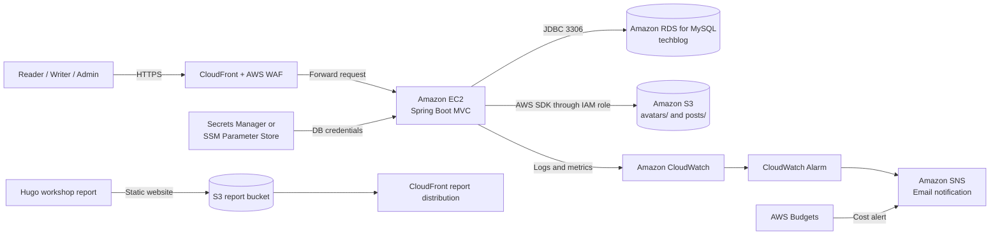

## Executive summary

TechBlog is a technology-blog web application built with Java 17, Spring Boot 3.5, Spring MVC, Spring Security, Spring Data JPA/Hibernate, Thymeleaf, MySQL, and Maven. It uses a monolithic MVC architecture in which server-rendered pages and business logic run in one Spring Boot application.

This proposal moves the TTV group project from a local environment to a practical, cost-conscious AWS environment. Amazon CloudFront and AWS WAF provide the public production/demo endpoint, Amazon EC2 runs the application JAR, Amazon RDS for MySQL replaces local MySQL, and Amazon S3 replaces `storage/avatars` and `storage/posts`. An IAM role grants least-privilege access to EC2; AWS Secrets Manager or Systems Manager Parameter Store protects database credentials. Amazon CloudWatch, Amazon SNS, and AWS Budgets provide operational and cost monitoring.

The first demo excludes NAT Gateway, Application Load Balancer, Auto Scaling, and RDS Multi-AZ because their cost and complexity are not yet required.

## Problem statement

The application currently runs at `http://localhost:8080`, connects to MySQL/Laragon at `localhost:3306/techblog`, and stores images on the developer machine. This creates several limitations:

- External users cannot access the application reliably.
- Images depend on one server disk and can be lost when the host changes.
- Business data depends on a local MySQL installation.
- Database credentials can be exposed when stored directly in configuration files.
- Centralized logs, metrics, operational alarms, and cost alerts are missing.
- Public login, registration, commenting, and upload functions need additional protection.

The solution must address these limitations while preserving the Spring MVC architecture rather than introducing an unnecessary React SPA or service split.

## Solution overview

TechBlog supports three roles:

- **Reader / USER:** register, log in, read, like, save, comment, reply, report comments, edit a profile, upload an avatar, and request Writer access.
- **Writer / EDITOR:** receive all Reader permissions and create, edit, or delete owned posts. Posts move through `PENDING`, `APPROVED`, and `REJECTED` states.
- **Admin / ADMIN:** manage users, categories, comments, and reports; approve or reject Writer requests and posts.

EC2 receives requests, applies Spring Security, processes business logic, and renders Thymeleaf pages. RDS stores business data, S3 stores avatars and post images, CloudWatch/SNS monitors operations, and Budgets controls cost.

## Solution architecture

The target production/demo flow is **User → CloudFront + AWS WAF → EC2 Spring Boot → RDS MySQL + S3**. During initial connectivity testing, the group may temporarily access the EC2 public IP on port 8080 before placing CloudFront and WAF in front of it.

The RDS security group accepts MySQL port 3306 only from the EC2 security group. The upload bucket keeps Block Public Access enabled unless a separate object-delivery design is introduced. Database credentials do not belong in the repository.

The Hugo report is a separate static website that can be published through S3 and CloudFront. GitHub remains useful for source control, but GitHub Pages is not the proposed final AWS hosting path for the report.

## AWS services

| Service | Purpose |
|---|---|
| AWS Budgets | Provide early cost alerts before and during the workshop. |
| Amazon EC2 | Run the Java 17 Spring Boot monolith with direct process control. |
| Amazon RDS for MySQL | Replace local MySQL and provide managed backups and database operations. |
| Amazon S3 | Store avatars and post images independently of the EC2 lifecycle. |
| AWS IAM role | Provide temporary least-privilege credentials without static access keys. |
| Secrets Manager or SSM Parameter Store | Store database credentials outside source code. |
| Amazon CloudWatch | Centralize logs, metrics, and alarms. |
| Amazon SNS | Deliver CloudWatch and cost notifications by email. |
| CloudFront and AWS WAF | Provide and protect the public endpoint after direct EC2 testing succeeds. |

Amplify Hosting is not the main platform because TechBlog has no separate SPA frontend. API Gateway is not the primary request path because Spring MVC handles requests and renders pages. Elastic Beanstalk is unnecessary for this EC2-focused workshop.

## Technical implementation plan

1. Test the local build and all Reader, Writer, and Admin workflows.
2. Externalize database and S3 configuration.
3. Create Zero Spend and monthly cost budgets before infrastructure.
4. Create an encrypted S3 bucket with `avatars/` and `posts/` prefixes.
5. Create an EC2 IAM role limited to the TechBlog bucket, CloudWatch, and the selected secret.
6. Create a small Single-AZ RDS for MySQL instance and the `techblog` database.
7. Permit RDS port 3306 only from the EC2 security group.
8. Build with the Maven Wrapper and upload the JAR to a small Java 17 EC2 instance.
9. Run with `DB_URL`, `DB_USERNAME`, `DB_PASSWORD`, `AWS_REGION`, and `S3_BUCKET`.
10. Test business workflows and confirm records in RDS and objects in S3.
11. Configure CloudWatch Logs, alarms, and an SNS email subscription.
12. Configure CloudFront and WAF, repeat end-to-end tests, collect evidence, and clean up unused resources.

Hibernate `ddl-auto=update` is acceptable for the demo. A longer-lived environment should use Flyway or Liquibase for versioned schema migration.

## Group scope and responsibilities

TechBlog is developed and deployed as the shared TTV group project. Sections **2-Proposal**, **3-BlogsPosted**, and **5-Workshop** are shared deliverables and must use the same TechBlog architecture, AWS decisions, and deployment procedure. The homepage, Worklog, Events Participated, Self-evaluation, and Feedback remain individual work.

The demo uses one primary AWS account for centralized resource and budget management. The group never shares root credentials. Members who need AWS access receive separate least-privilege IAM users or roles.

| Role | Responsibility |
|---|---|
| Member 1 – AWS Deployment Lead | Create Budgets, S3, RDS, and EC2; configure variables; run TechBlog on AWS. |
| Member 2 – Application & Database | Test locally, configure the database, test all roles, and validate RDS data. |
| Member 3 – Storage & Security | Test uploads, S3, IAM, secret storage, and proposed WAF rules. |
| Member 4 – Monitoring & Documentation | Configure CloudWatch/SNS and maintain cleanup, diagrams, and workshop documentation. |

## Timeline and milestones

| Time | Work | Milestone |
|---|---|---|
| Week 1 | Test locally, externalize configuration, create Budgets | JAR ready and cost alerts active |
| Week 2 | Create S3, IAM role, RDS, and security groups | Data infrastructure ready |
| Week 3 | Integrate S3/RDS and deploy EC2 | TechBlog reachable on AWS |
| Week 4 | Add CloudFront/WAF, test roles, monitor, secure, and clean up | Public endpoint, demo, and evidence complete |
| Later phase | Add a custom domain, ALB, Auto Scaling, Multi-AZ, and migrations | More scalable production architecture |

## Cost optimization

Exact cost depends on Region, instance types, runtime, storage, data transfer, and current Free Tier eligibility. The final configuration should be entered into AWS Pricing Calculator before resources are created.

- Select a small EC2 instance with enough memory for the JVM and stop it when unused.
- Use a small Single-AZ development RDS instance with limited storage.
- Exclude NAT Gateway, ALB, Auto Scaling, and Multi-AZ from the first demo.
- Use one bucket with prefixes rather than unnecessary buckets.
- Set a short, appropriate CloudWatch Logs retention period.
- Configure actual and forecast budget thresholds and tag resources with `Project=TechBlog`.
- Remove edge, compute, database, storage, log, and alarm resources after the workshop.

## Risk assessment

| Risk | Impact | Mitigation |
|---|---|---|
| A single EC2 instance fails | Website becomes unavailable | Store state in RDS/S3 and document recovery. |
| Single-AZ RDS interruption | Database becomes unavailable | Use backups for the demo and consider Multi-AZ later. |
| Overly broad storage or network access | Data exposure | Keep S3 private, scope IAM resources, and reference security groups. |
| Credentials are committed or logged | Database compromise | Use Secrets Manager/SSM, mask secrets, and rotate them when needed. |
| Malicious or oversized uploads | Security and storage impact | Validate MIME type, extension, size, and randomized object keys. |
| Automated login/comment abuse | Load and spam | Use Spring Security and WAF rate-based rules. |
| Unexpected cost | Group budget overrun | Use Budgets, tags, billing checks, and a cleanup checklist. |
| Uncontrolled schema changes | Data inconsistency | Back up data and move from `ddl-auto=update` to migrations. |

## Expected outcomes

- TechBlog is tested first through the EC2 public endpoint and then accessed through a CloudFront endpoint protected by AWS WAF.
- Reader, Writer, Admin, Writer-request, and post-approval workflows work correctly.
- Users, posts, categories, comments, reports, likes, and saves persist in RDS.
- Avatars and post images persist in S3 rather than on the EC2 disk.
- EC2 accesses AWS services through an IAM role with no static key in source code.
- CloudWatch collects operational data and SNS delivers a test notification.
- Spending remains within the budget and all demo resources can be cleaned up.

## Future development

After the CloudFront/WAF demo is stable, the group can add a custom domain and ACM certificate. If traffic grows, it can introduce an ALB, private application subnets, Auto Scaling, and RDS Multi-AZ. Other improvements include CI/CD, Flyway or Liquibase, backup-recovery tests, S3 lifecycle policies, and a disaster-recovery procedure. Each addition should provide operational value that justifies its cost.
