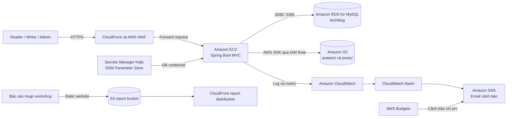

## Tóm tắt đề xuất

TechBlog là ứng dụng web blog công nghệ được xây dựng bằng Java 17, Spring Boot 3.5, Spring MVC, Spring Security, Spring Data JPA/Hibernate, Thymeleaf, MySQL và Maven. Ứng dụng sử dụng kiến trúc monolithic MVC: giao diện render phía máy chủ và phần xử lý nghiệp vụ được đóng gói chung trong một ứng dụng Spring Boot.

Đề xuất chuyển môi trường local lên AWS theo mô hình thực tế nhưng tiết kiệm chi phí cho project nhóm TTV. Amazon CloudFront và AWS WAF là endpoint production/demo public, Amazon EC2 chạy file JAR, Amazon RDS for MySQL thay MySQL local và Amazon S3 thay hai thư mục `storage/avatars`, `storage/posts`. IAM Role cấp quyền tối thiểu cho EC2; AWS Secrets Manager hoặc Systems Manager Parameter Store bảo vệ thông tin đăng nhập database. Amazon CloudWatch, Amazon SNS và AWS Budgets cung cấp giám sát, cảnh báo vận hành và cảnh báo chi phí. Báo cáo workshop Hugo cũng có thể public bằng Amazon S3 và CloudFront như một static report website.

Bản demo đầu không dùng NAT Gateway, Application Load Balancer, Auto Scaling hoặc RDS Multi-AZ vì chi phí và độ phức tạp chưa cần thiết.

## Vấn đề cần giải quyết

Ứng dụng hiện chạy tại `http://localhost:8080`, kết nối MySQL/Laragon ở `localhost:3306/techblog` và lưu ảnh trên máy phát triển. Môi trường này có các hạn chế:

- Người dùng bên ngoài không thể truy cập ổn định.
- Ảnh phụ thuộc vào một ổ đĩa và có thể mất khi thay máy chủ.
- Dữ liệu nghiệp vụ phụ thuộc vào MySQL local.
- DB credential có thể bị lộ nếu ghi trực tiếp trong file cấu hình.
- Chưa có log tập trung, metric, cảnh báo lỗi và cảnh báo chi phí.
- Các chức năng login, register, comment và upload cần lớp bảo vệ khi public.

Giải pháp phải khắc phục các vấn đề trên nhưng vẫn giữ nguyên kiến trúc Spring MVC, không chuyển TechBlog thành React SPA hoặc tách hệ thống không cần thiết.

## Tổng quan giải pháp

TechBlog phục vụ ba vai trò:

- **Reader / USER:** đăng ký, đăng nhập, đọc bài, like, save, comment, reply, report comment, sửa profile, upload avatar và gửi yêu cầu nâng cấp Writer.
- **Writer / EDITOR:** có toàn bộ quyền Reader, đồng thời tạo, sửa và xóa bài của mình. Bài viết đi qua `PENDING`, `APPROVED` và `REJECTED`.
- **Admin / ADMIN:** quản lý user, category, comment, report; duyệt hoặc từ chối writer request; duyệt hoặc từ chối bài viết.

EC2 tiếp nhận request, thực thi Spring Security, xử lý nghiệp vụ và render Thymeleaf. RDS lưu dữ liệu nghiệp vụ; S3 lưu avatar và ảnh bài viết; CloudWatch/SNS theo dõi vận hành; Budgets cảnh báo chi phí.

## Kiến trúc giải pháp

Luồng production/demo mong muốn cho TechBlog là **User → CloudFront + AWS WAF → EC2 Spring Boot → RDS MySQL + S3**. Khi kiểm tra kết nối ban đầu, nhóm có thể tạm truy cập public IP của EC2 qua cổng 8080 trước khi đặt CloudFront và WAF phía trước ứng dụng. Security Group của RDS chỉ nhận cổng MySQL 3306 từ Security Group của EC2. S3 bucket lưu upload của ứng dụng giữ Block Public Access mặc định, trừ khi nhóm có thiết kế phân phối object riêng. DB credential không nằm trong repository.

Báo cáo workshop là một Hugo static site riêng. GitHub có thể dùng để lưu source code ứng dụng và nội dung report, nhưng GitHub Pages không phải hướng public deployment chính trong đề xuất này. Website báo cáo cuối cùng có thể deploy bằng **S3 + CloudFront** để thống nhất với kiến trúc AWS của workshop.

## Dịch vụ AWS sử dụng

| Dịch vụ | Mục đích và lý do chọn |
|---|---|
| AWS Budgets | Cảnh báo sớm chi phí trước và trong workshop |
| Amazon EC2 | Phù hợp ứng dụng Spring MVC monolithic và cho phép kiểm soát tiến trình Java 17 |
| Amazon RDS for MySQL | Thay MySQL local, hỗ trợ backup và vận hành database |
| Amazon S3 | Lưu avatar, ảnh bài viết độc lập với vòng đời EC2 |
| AWS IAM Role | Cấp temporary credential và quyền tối thiểu, không cần Access Key tĩnh |
| Secrets Manager hoặc SSM Parameter Store | Lưu DB credential ngoài source code |
| Amazon CloudWatch | Tập trung log, metric và alarm |
| Amazon SNS | Gửi cảnh báo CloudWatch và chi phí qua email |
| CloudFront và AWS WAF | Lớp public production/demo cho TechBlog sau khi ứng dụng EC2 đã kiểm tra kết nối trực tiếp ổn định |

Báo cáo workshop Hugo có thể publish riêng bằng Amazon S3 và CloudFront như một static website. GitHub vẫn hữu ích cho quản lý phiên bản, nhưng không phải hướng hosting public chính cho demo/report trong đề xuất này.

Amplify Hosting không phải nền tảng chính vì TechBlog không có SPA frontend tách riêng. API Gateway không phải luồng request chính vì Spring MVC xử lý và render trang. Elastic Beanstalk cũng không cần cho workshop ưu tiên EC2.

## Kế hoạch triển khai kỹ thuật

1. Kiểm tra build local và toàn bộ luồng Reader, Writer, Admin.
2. Tách cấu hình database và S3 thành biến môi trường.
3. Tạo Zero Spend Budget và Monthly Cost Budget trước hạ tầng.
4. Tạo S3 bucket mã hóa với prefix `avatars/`, `posts/`.
5. Tạo EC2 IAM Role, chỉ cho phép truy cập bucket TechBlog, CloudWatch và secret đã chọn.
6. Tạo RDS MySQL nhỏ, Single-AZ và database `techblog`.
7. Chỉ cho phép Security Group EC2 truy cập RDS qua cổng 3306.
8. Build bằng Maven Wrapper, upload JAR lên EC2 nhỏ có Java 17.
9. Chạy ứng dụng với `DB_URL`, `DB_USERNAME`, `DB_PASSWORD`, `AWS_REGION`, `S3_BUCKET`.
10. Kiểm thử nghiệp vụ, xác nhận dữ liệu trong RDS và object trong S3.
11. Cấu hình CloudWatch Logs, alarm và SNS email.
12. Lưu bằng chứng và cleanup tài nguyên không cần thiết.

Hibernate `ddl-auto=update` phù hợp bản demo. Môi trường lâu dài nên dùng Flyway hoặc Liquibase để quản lý migration theo phiên bản.

## Phạm vi nhóm

TechBlog được phát triển và triển khai như project kỹ thuật dùng chung của nhóm TTV. Các phần **2-Proposal**, **3-BlogsPosted** và **5-Workshop** là deliverable dùng chung của nhóm, cần thống nhất về kiến trúc TechBlog, quyết định AWS và quy trình triển khai.

Trang đầu, **1-Worklog**, **4-EventParticipated**, **6-Self-evaluation** và **7-Feedback** vẫn là phần cá nhân của từng sinh viên. Các phần này có thể phản ánh hoạt động, kết quả học tập, sự kiện đã tham gia và feedback riêng của từng thành viên.

Môi trường AWS được quản lý như một môi trường triển khai chung để kiểm soát chi phí và tránh tạo tài nguyên trùng lặp. Nhóm không dùng chung root AWS account. Nếu nhiều thành viên cần truy cập, nhóm sẽ tạo IAM user hoặc IAM role riêng theo nguyên tắc least privilege.

## Phân công nhóm

Bản demo TechBlog sử dụng một AWS account chính để triển khai. Cách làm này giúp nhóm quản lý tài nguyên tập trung, theo dõi AWS Budgets dễ hơn và tránh phát sinh chi phí rải rác trên nhiều tài khoản cá nhân. Nhóm không cần tạo bốn AWS account riêng cho workshop demo.

Nhóm không dùng chung root credentials. Root account chỉ nên dùng cho billing, account recovery hoặc các thao tác cấp tài khoản khi thật sự cần. Nếu thành viên cần thao tác trực tiếp trên AWS, nhóm sẽ tạo IAM user hoặc role riêng theo nguyên tắc least privilege.

Trong bản demo, một thành viên phụ trách triển khai AWS chính. Các thành viên còn lại tập trung vào nghiệp vụ ứng dụng, kiểm thử, tài liệu, monitoring và security review. EC2 nên truy cập S3 và dịch vụ giám sát thông qua IAM Role. Cách này an toàn hơn so với lưu Access Key tĩnh trong source code hoặc file cấu hình của TechBlog.

| Vai trò | Trách nhiệm |
|---|---|
| Member 1 - AWS Deployment Lead | Tạo AWS Budgets, S3, RDS, EC2, cấu hình biến môi trường và chạy TechBlog trên AWS. |
| Member 2 - Application & Database | Kiểm thử local, cấu hình database, kiểm tra luồng Reader, Writer, Admin và xác nhận dữ liệu trong RDS. |
| Member 3 - Storage & Security | Kiểm tra upload image flow, S3 bucket, IAM Role, Secrets Manager hoặc SSM Parameter Store và đề xuất WAF rule. |
| Member 4 - Monitoring & Documentation | Cấu hình CloudWatch, SNS, checklist dọn dẹp tài nguyên, workflow diagram và nội dung workshop report. |

AWS Budgets là lớp kiểm soát chi phí chung cho toàn bộ nhóm. Dịch vụ này giúp phát hiện chi phí bất thường sớm trong khi vẫn giữ kiến trúc demo đơn giản và tập trung.

## Lộ trình và mốc triển khai

| Thời gian | Công việc | Mốc hoàn thành |
|---|---|---|
| Tuần 1 | Kiểm tra local, tách cấu hình, tạo Budgets | JAR sẵn sàng và có cảnh báo chi phí |
| Tuần 2 | Tạo S3, IAM Role, RDS và Security Group | Hạ tầng dữ liệu sẵn sàng |
| Tuần 3 | Tích hợp S3/RDS và deploy EC2 | TechBlog truy cập được trên AWS |
| Tuần 4 | Kiểm thử vai trò, monitoring, bảo mật và cleanup | Hoàn tất demo và bằng chứng |
| Tuần 4 | CloudFront/WAF, kiểm thử vai trò, monitoring, bảo mật và cleanup | Hoàn tất endpoint public, demo và bằng chứng |
| Giai đoạn sau | Custom domain, ALB, Auto Scaling, Multi-AZ và migration | Kiến trúc production có khả năng mở rộng cao hơn |

## Ước tính ngân sách và tối ưu chi phí

Chi phí chính xác phụ thuộc Region, loại instance, số giờ chạy, storage, data transfer và điều kiện Free Tier tại thời điểm triển khai. Cần nhập cấu hình cuối vào AWS Pricing Calculator trước khi tạo tài nguyên.

- Chọn EC2 nhỏ nhưng đủ RAM cho JVM và stop khi không sử dụng.
- Dùng RDS dev/test nhỏ, Single-AZ và storage giới hạn.
- Không dùng NAT Gateway, ALB, Auto Scaling hoặc Multi-AZ ở bản demo đầu.
- Dùng một bucket với prefix thay vì tạo nhiều bucket không cần thiết.
- Đặt retention CloudWatch Logs ngắn và phù hợp.
- Tạo Budget alert theo nhiều ngưỡng actual/forecast.
- Gắn tag `Project=TechBlog`.
- Xóa instance, snapshot, object, log, alarm và tài nguyên edge sau workshop.

## Đánh giá rủi ro

| Rủi ro | Ảnh hưởng | Biện pháp |
|---|---|---|
| EC2 đơn lẻ gặp sự cố | Website tạm dừng | Lưu state trong RDS/S3 và ghi quy trình dựng lại |
| RDS Single-AZ gián đoạn | Database không khả dụng | Dùng backup cho demo; cân nhắc Multi-AZ về sau |
| Quyền bucket hoặc network quá rộng | Rò rỉ dữ liệu | Block Public Access, IAM giới hạn resource và tham chiếu Security Group |
| Credential bị commit hoặc ghi log | Database bị xâm nhập | Dùng Secrets Manager/SSM, ẩn secret trong log và rotate khi cần |
| Upload độc hại hoặc quá lớn | Tăng storage hoặc mất an toàn | Kiểm tra MIME, extension, kích thước và tên object ngẫu nhiên |
| Tự động spam login/comment | Tăng tải và nội dung rác | Spring Security và WAF rate-based rule trong bước bảo vệ endpoint public |
| Chi phí ngoài dự kiến | Vượt ngân sách nhóm TTV | Budgets, tag, kiểm tra Billing thường xuyên và checklist cleanup |
| Schema thay đổi ngoài kiểm soát | Dữ liệu không nhất quán | Backup và chuyển từ `ddl-auto=update` sang migration |

## Kết quả kỳ vọng

- TechBlog được kiểm tra ban đầu qua public endpoint của EC2 và truy cập chính thức qua endpoint CloudFront có AWS WAF bảo vệ.
- Luồng Reader, Writer, Admin, writer request và duyệt bài hoạt động đúng.
- User, post, category, comment, report, like và save được lưu trong RDS.
- Avatar và ảnh bài viết nằm trong S3, không phụ thuộc disk EC2.
- EC2 truy cập AWS bằng IAM Role, không có static key trong source.
- CloudWatch thu thập dữ liệu vận hành và SNS gửi được cảnh báo thử nghiệm.
- Chi phí nằm trong Budget và mọi tài nguyên demo có thể cleanup.

## Hướng phát triển tương lai

Sau khi bản demo CloudFront/WAF ổn định, có thể bổ sung custom domain và chứng chỉ ACM. Khi lưu lượng tăng, có thể cân nhắc ALB, private subnet cho ứng dụng, Auto Scaling và RDS Multi-AZ. Các cải tiến khác gồm CI/CD, Flyway hoặc Liquibase, kiểm thử phục hồi backup, S3 lifecycle và quy trình disaster recovery. Chỉ nên bổ sung khi lợi ích vận hành tương xứng với chi phí.
